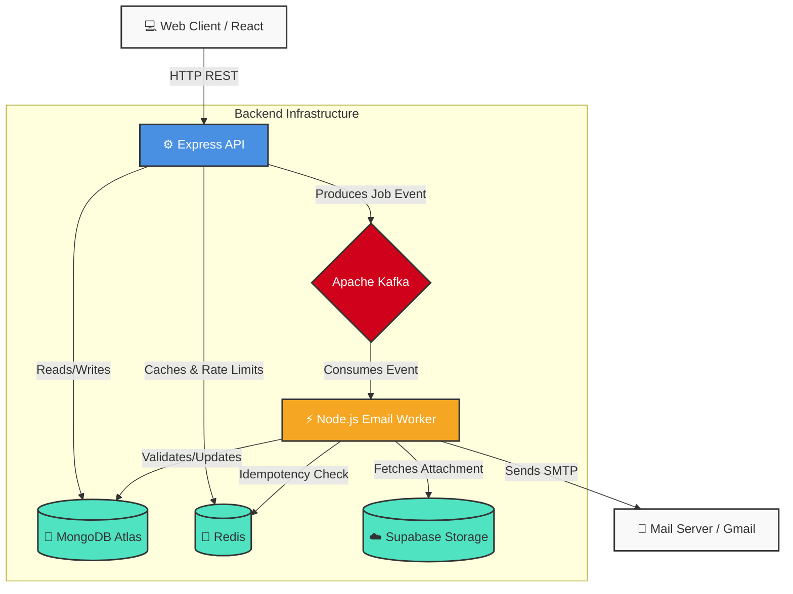

# 🧊 ColdStream

<div align="center">
  
  
  
  
</div>
<br/>

**ColdStream** is a high-performance, asynchronous cold email dispatching platform built with React, Node.js, and Apache Kafka. Automate your outreach with powerful templating, resume attachments, and a modern, high-end minimal interface.

---

## 🌟 Key Features

- **🚀 Async Dispatch Engine**: Powered by Apache Kafka for guaranteed, high-throughput email delivery.
- **🎨 Modern UI/UX**: A sleek, Vercel-inspired minimalist design system built with TailwindCSS and Framer Motion.
- **📊 Visual Job Tracking**: Track the precise stage of your emails in real-time with visual inline flowcharts.
- **🛡️ Idempotent Operations**: Built-in rate limiting and idempotency (via Redis) to prevent duplicate emails and recruiter spam.
- **☁️ Cloud Storage**: Resume PDF uploads seamlessly integrated with Supabase storage.

---

## 🏗️ Architecture

ColdStream follows a robust event-driven microservices architecture:



### Flow Breakdown
1. **User Request**: The React frontend sends a dispatch request containing the template ID and recipient email.
2. **API Layer**: Express validates the request, checks rate limits in Redis, saves a `queued` job to MongoDB, and produces an event to Kafka.
3. **Queue**: Kafka buffers the high-volume email requests on the `email-dispatch-topic`.
4. **Worker Layer**: The consumer background worker pulls the job, formats the HTML, attaches the resume from Supabase, and dispatches it via Nodemailer.

---

## 🚀 Getting Started

Follow these guidelines to set up the project locally.

### 1. Prerequisites
- **Node.js**: v18+
- **Docker**: For running Kafka, Zookeeper, and Redis.
- **MongoDB Atlas**: Or a local MongoDB instance.

### 2. Infrastructure Setup
Start the local message broker and cache:
```bash
docker-compose up -d
```
*This will spin up Zookeeper, Kafka (port 9092), and Redis (port 6379).*

### 3. Environment Variables
Create `.env` files in both the API and Worker packages based on `.env.example`.

**Critical Variables:**
- `MONGODB_URI`: Must point to the same database for both API and Worker.
- `KAFKA_BROKER`: `localhost:9092`
- `SMTP_USER` / `SMTP_PASS`: Your email credentials (e.g., Gmail App Password).

### 4. Running the Project
ColdStream uses NPM workspaces.

**Start the API Server:**
```bash
npm run dev:api
```

**Start the Background Worker:**
```bash
npm run dev:worker
```

**Start the Web Frontend:**
```bash
npm run dev:web
```

---

## 🎨 UI Guidelines & Design System

The frontend strictly follows a **high-end minimalist aesthetic**:
- **Colors**: White, off-whites (gray-50), and crisp borders (white/40). Avoid heavy, muddy gradients.
- **Typography**: Inter (sans-serif) for clean readability.
- **Components**: 
  - *Cards*: Use the `.glass-card` class for a subtle, frosted look with sharp borders.
  - *Buttons*: Solid black/primary for primary actions, subtle gray hover states for secondary.
- **Animations**: Use `framer-motion` for micro-interactions (e.g., the Inline Tracker dropdown) to keep the app feeling responsive and alive.
