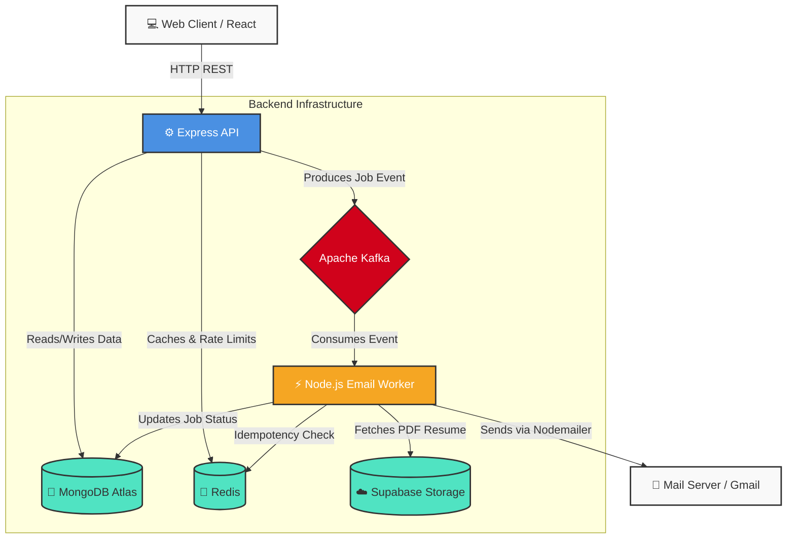

<div align="center">
  
  
  
  
  
  
</div>

<h1 align="center">🧊 ColdStream</h1>

<p align="center">
  <strong>A high-performance, asynchronous cold email dispatching platform.</strong><br/>
  Automate your outreach with powerful templating, seamless resume attachments, and guaranteed delivery via Apache Kafka.
</p>

---

## 🌟 Overview

**ColdStream** is an enterprise-grade solution for managing outbound recruitment and sales emails. Built around a robust event-driven microservices architecture, it ensures that your emails are never lost in transit, preventing duplicate dispatches through advanced idempotency caching, and providing a stunning, minimalistic Vercel-inspired user interface.

### ✨ Core Features
- **🚀 Async Dispatch Engine**: Powered by Apache Kafka for guaranteed, high-throughput email delivery with optimized single-producer worker architecture.
- **🎨 Modern UI/UX**: A sleek, high-end minimalist design system built with TailwindCSS, Framer Motion, and global toast notifications via `react-hot-toast`.
- **📊 Visual Job Tracking**: Track the precise stage of your emails in real-time with an interactive, inline flowchart tracker.
- **🛡️ Enterprise Security**: Comprehensive API protection featuring global rate limiting (`express-rate-limit`), NoSQL injection prevention (`express-mongo-sanitize`), and strict input validation via `Zod`.
- **⚡ Advanced Data Caching**: Intelligent state management and request deduplication using `Zustand` and `@tanstack/react-query`, backed by `Redis` on the server.
- **☁️ Cloud Storage**: Resume PDF uploads seamlessly integrated with Supabase storage.
- **📝 Dynamic Templating**: Create reusable email templates with dynamic variable injection (`{{company}}`, `{{role}}`).

---

## 🏗️ System Architecture

ColdStream is decoupled into three primary packages managed via NPM Workspaces. The architecture guarantees high availability and fault tolerance.



### 🧩 Package Structure
| Package | Stack | Responsibility |
|---|---|---|
| **`packages/web`** | React 18, Vite, Tailwind, Zustand, React Query | Provides the dashboard, template editor, resume uploader, and visual dispatch tracker. Includes global toast handling and advanced caching. |
| **`packages/api`** | Node.js, Express, Mongoose, Zod | The secure REST API layer. Handles authentication, stores entities in MongoDB, enforces rate limits in Redis, validates schemas via Zod, and pushes jobs to Kafka. |
| **`packages/worker`** | Node.js, KafkaJS, Nodemailer | The resilient background processor. Subscribes to Kafka, formats HTML emails, attaches resumes from Supabase, and dispatches via SMTP with zero memory leaks. |

---

## 🚀 Getting Started

Follow these comprehensive guidelines to set up the project locally.

### 1. Prerequisites
Ensure you have the following installed on your local development machine:
- **Node.js**: v18 or higher
- **Docker & Docker Compose**: Required for running Kafka, Zookeeper, and Redis.
- **MongoDB Atlas**: A free tier cluster (or a local MongoDB instance).
- **Supabase**: A free tier project for blob storage.

### 2. Infrastructure Setup
Start the local message broker and caching layer using Docker:
```bash
# From the project root
docker-compose up -d
```
> *This provisions Zookeeper, Apache Kafka (port `9092`), and Redis (port `6379`) in the background.*

### 3. Environment Variables
You must configure the `.env` files for both the API and the Worker. 

**API Environment (`packages/api/.env`)**
```env
PORT=8080
MONGODB_URI=mongodb+srv://<user>:<password>@cluster.mongodb.net/coldstream
REDIS_URL=redis://localhost:6379
KAFKA_BROKER=localhost:9092
JWT_SECRET=your_super_secret_jwt_key
SUPABASE_URL=https://your-project.supabase.co
SUPABASE_ANON_KEY=your_supabase_anon_key
```

**Worker Environment (`packages/worker/.env`)**
```env
MONGODB_URI=mongodb+srv://<user>:<password>@cluster.mongodb.net/coldstream
KAFKA_BROKER=localhost:9092
REDIS_URL=redis://localhost:6379
SMTP_HOST=smtp.gmail.com
SMTP_PORT=587
SMTP_USER=your_email@gmail.com
SMTP_PASS=your_app_specific_password
```
> **⚠️ Critical:** Both the `api` and `worker` must point to the **same** MongoDB database and Kafka broker to communicate properly.

### 4. Running the Application
ColdStream uses NPM workspaces to manage dependencies across all three packages simultaneously.

1. **Install Dependencies (Root Level)**
   ```bash
   npm install
   ```
2. **Start the API Server**
   ```bash
   npm run dev:api
   ```
3. **Start the Background Worker**
   ```bash
   npm run dev:worker
   ```
4. **Start the Web Frontend**
   ```bash
   npm run dev:web
   ```

Open your browser to `http://localhost:5173` to access the ColdStream Dashboard!

---

## 🎨 UI Guidelines & Design System

The frontend strictly adheres to a **high-end minimalist aesthetic** aimed at maximizing developer and user experience:
- **Palette**: Monochromatic with white, off-whites (`gray-50`), and crisp translucent borders (`white/40`). Avoid heavy, muddy gradients.
- **Typography**: `Inter` (sans-serif) for clean, modern readability.
- **Components**: 
  - *Cards*: Use the `.glass-card` CSS class for a subtle, frosted layout with sharp, distinct borders.
  - *Buttons*: Solid black/primary for primary actions, subtle gray hover states for secondary actions.
- **Animations**: `framer-motion` is utilized for micro-interactions (e.g., the Inline Job Tracker accordion dropdown) to keep the application feeling deeply responsive and alive.

---

## 🛠️ Error Handling & Troubleshooting

ColdStream features a robust, self-healing architecture:
- **API Crashes**: Global `asyncHandler` wrappers prevent Express from crashing due to unhandled promise rejections (e.g., duplicate job conflicts).
- **Worker Restarts**: The Kafka consumer uses `fromBeginning: true` to ensure that if the worker goes offline, any queued jobs are instantly processed upon restart.
- **Visual Diagnostics**: The web dashboard automatically parses backend stack traces (e.g., MongoDB disconnects, SMTP Auth errors) and displays human-readable diagnostic tags directly in the visual tracker.
